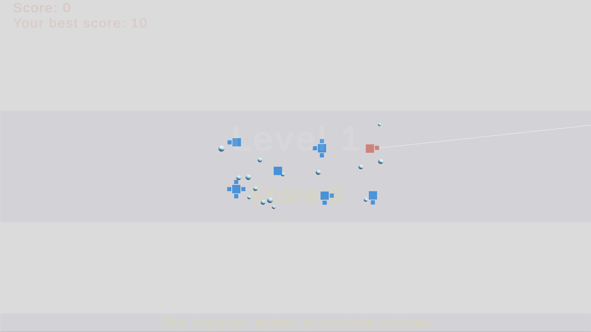
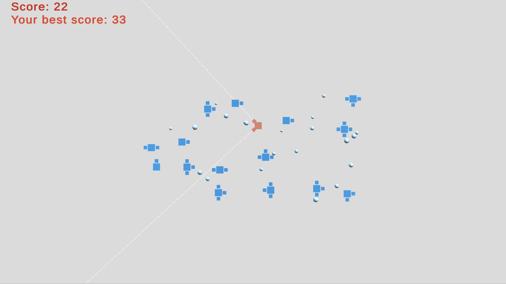

## Description 
Sup is a one button mechanic game prototype. You have to collect as much scores as possible by infecting all moving objects. 

  

Play online [here(github)](https://cholushkin.github.io/webgl/sup/index.html) or [here(itch.io)](https://cholushkin.itch.io/sup)

Features:
* Playfab for leaderboard;
* Dreamlo (http://dreamlo.com/) for another leaderboard implementation on another branch (doesn't work in browser for free);
* BSP for level generation (https://en.wikipedia.org/wiki/Binary_space_partitioning);
* No sound, no effects, bare minimum code;
* No game state (restart scene for each next level)
* Custom events (GameLib: https://github.com/cholushkin/gamelib/tree/master/Events )
* DoTween (http://dotween.demigiant.com/) for all animations;

Feel free to do pull requests. And have a nice day! :)

